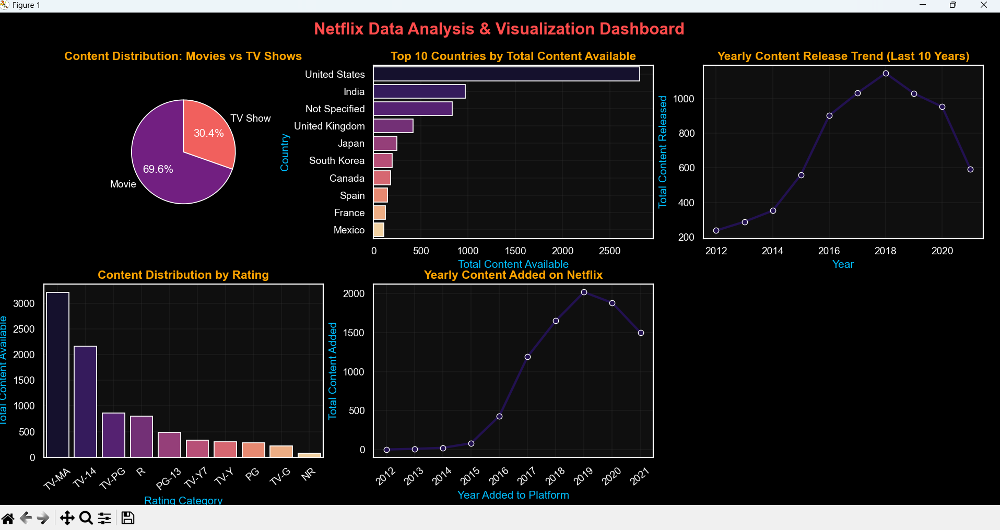

# 🎬 Netflix Data Analysis & Visualization Dashboard

## 📌 Project Overview
This project is a Python-based data analysis and visualization dashboard that explores Netflix Movies and TV Shows dataset. It helps in understanding content trends, distribution, and insights using real data.

---

## 🎯 Objective
The objective of this project is to analyze Netflix data and understand:
- Movies vs TV Shows distribution
- Top countries producing Netflix content
- Year-wise content growth trends
- Ratings distribution
- Content added over time

---

## 🛠️ Tools & Technologies Used
- Python 🐍
- Pandas (Data Cleaning & Analysis)
- Matplotlib (Data Visualization)
- Seaborn (Advanced Charts)

---

## 📂 Dataset Details
The dataset includes Netflix titles with following information:
- Title
- Type (Movie / TV Show)
- Country
- Release Year
- Rating
- Date Added

---

## 📊 Key Insights
- Movies are more than TV Shows on Netflix
- USA is the leading content producer
- Most content was added in recent years
- TV-MA and TV-14 are the most common ratings
- Netflix content is continuously growing

---

## 📸 Dashboard Preview


---

## 🚀 How to Run
```bash
pip install pandas matplotlib seaborn
python netflix_dashboard.py